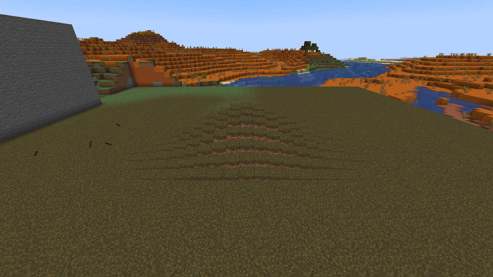
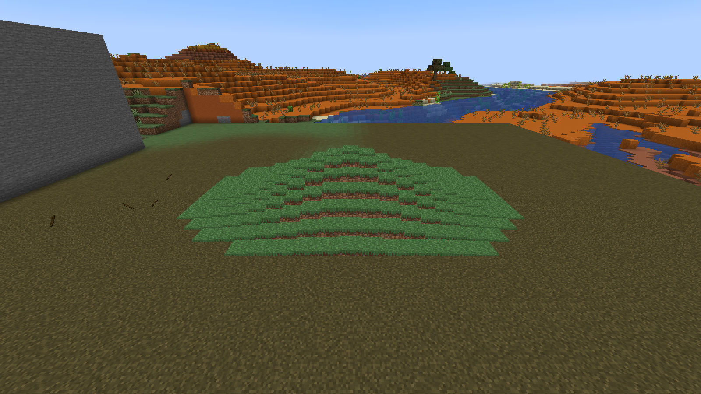
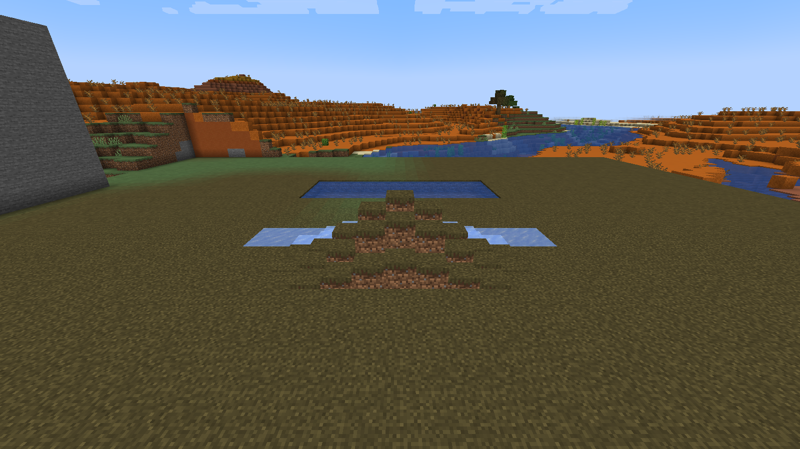
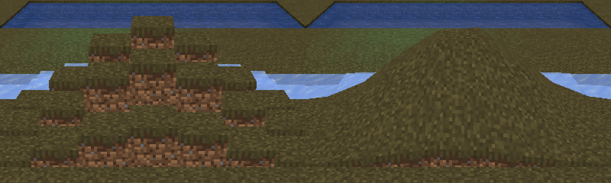

# Этап 0: спайк рендера бугра

**Решение: аддитивный клиентский рендер** (SPEC 6.3, основной вариант). `BlockDisplay` остаётся в коде только как
`/tremor spike display` для сравнения и будет удалён вместе с пакетом `tremor.spike` на этапе 1.

## Как мерили

Скриптовый прогон `gradlew runClientAutotest -Ptremor_autotest_script=stage0-spike.txt`: мир с фиксированным сидом,
ровная площадка из травы 49×49, камера-наблюдатель в 15 блоках от бугра, по 15 с замера на каждый режим.
Окно 1600×900, дальность прорисовки 12, vsync выкл. Машина: Intel Core i5-14400, AMD Radeon RX 6800 XT.

Два размера бугра:

* **обычный** — параметры по умолчанию (A = 2, σ ≈ 1.6–2.6);
* **большой** — A = 3, все длины ×2.2, это ~300 копий блоков (нижняя граница бюджета SPEC 16 «400–800 копий»).

## Цифры

| Режим | FPS | кадр, мс (среднее) | +к кадру, мс | Копий / сущностей |
|---|---:|---:|---:|---:|
| без бугра | 1292 | 0.774 | — | — |
| аддитивный, обычный | 1267 | 0.789 | +0.015 | 49 копий |
| аддитивный, обычный, «дышит» | 1285 | 0.778 | +0.004 | 39 |
| аддитивный, большой | 1132 | 0.884 | **+0.11** | 303 копии |
| аддитивный, большой, «дышит» | 1136 | 0.880 | +0.11 | 237 |
| block_display, обычный | 1204 | 0.831 | +0.057 | 68 сущностей |
| block_display, обычный, «дышит» | 1258 | 0.795 | +0.02 | 68 |
| block_display, большой | 694 | 1.44 | **+0.67** | 413 сущностей |
| block_display, большой, «дышит» | 620 | 1.61 | +0.84 | 413 |

Собственное время аддитивного рендера (CPU, включая отправку на GPU): 0.08 мс/кадр для обычного бугра,
0.43 мс/кадр для большого (~12 тыс. вершин). Сырые данные: [stage0/bench-run2.csv](stage0/bench-run2.csv).

**Сеть.** Аддитивный режим: один пакет ≈ 90 байт на изменение состояния (на этапе 1 — 5–10 раз в секунду,
укладывается в бюджет «< 100 байт»). `block_display`: спавн 5 КБ / 31 КБ (обычный / большой) и
**15–116 КБ/с на каждого игрока**, пока бугор шевелится, — каждая копия шлёт свой пакет данных сущности.
Для бугра, который ползёт, добавятся ещё спавн и удаление сущностей по краям.

## Вид

| Аддитивный (большой бугор) | block_display (тот же бугор) |
|---|---|
|  |  |

* Аддитивные копии рисуются тем же путём, что и земля: правильный цвет травы биома, тени граней как у ландшафта,
  свет берётся из открытой клетки рядом с исходным блоком, трава/цветы/снег на блоке едут вместе с ним.
* `block_display` красит траву стандартным зелёным (без оттенка биома — в бесплодных землях это сразу заметно),
  не несёт растения и освещается как сущность.

Проверено также: режимы графики Fast/Fancy/**Fabulous**, полупрозрачные блоки (лёд) в бугре, вода за бугром,
**Sodium 0.8.13** — везде рисуется корректно ([скрипт](../autotest/stage0-compat.txt)).

## Стиль: «блоки» (по ТЗ) или «warp»

Кроме варианта из ТЗ (копии блоков, сдвинутые целиком, промежуток заполнен копиями) сделан второй стиль: каждая
вершина сдвигается на h в своей точке, соседние копии делят вершины, и получается гладкий холм без ступенек.
Стоит столько же. Переключается командой `/tremor spike style blocks|warp`.

По умолчанию — «блоки», как в ТЗ.

## Отступления от ТЗ и уточнения

* **Дрожь (ε) затухает вместе с бугром.** В формуле 6.1 шум добавляется везде, где считается h. Тогда весь диск
  радиуса R дрожал бы на ±ε·A (больше порога 0.05) и обрывался резкой границей. Шум умножается на огибающую бугра
  и следа (0..1).
* **Сглаживание нормалей (6.2) учитывает только соседей, смотрящих в ту же сторону.** Иначе нижняя грань плиты
  толщиной 2 блока (потолок пещеры под самой землёй) гасила вертикальную составляющую, и нормали ровного пола
  ложились почти горизонтально.
* **«Твёрдое» (кожа мира)** — блоки с полной коллизией, непрозрачные полные кубы (грязь, песок душ) и почти полные
  (тропинка, пашня). Листва не считается. Непрогруженные чанки и всё ниже мира — «неизвестно»: твёрдое, но не
  поверхность, чтобы сущность не ходила по краю прогруженного мира и по дну пустоты.
* **Влияние бугра** ограничено не только радиусом R, но и полосой ±2.5 блока вдоль нормали и согласием нормалей.
  Иначе потолок пещеры прямо над бугром на полу вспучивался бы тоже: формула 6.1 не зависит от d·n.
* **Копии рисуются с небольшим постоянным смещением глубины.** Так нижняя копия, наполовину утопленная в исходный
  блок, не мерцает на совпадающих гранях.
