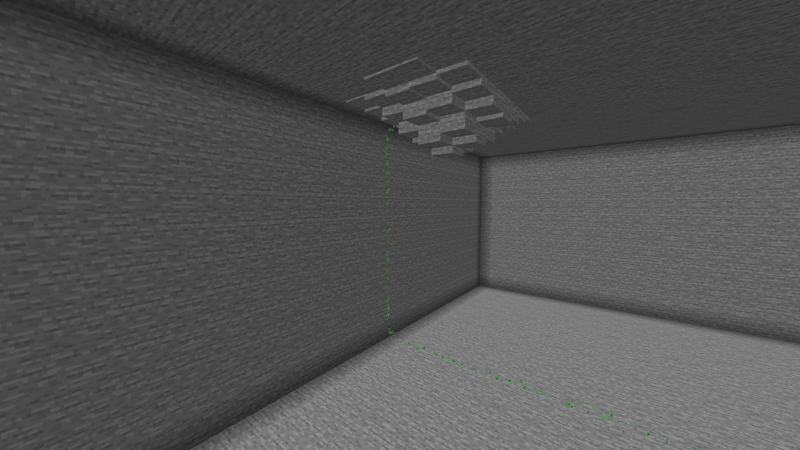
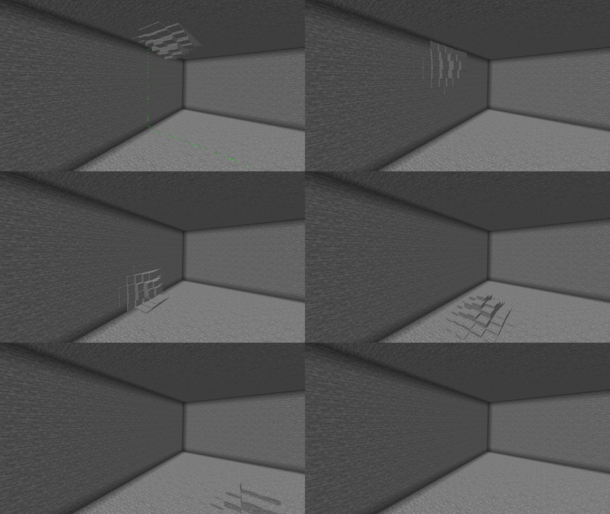
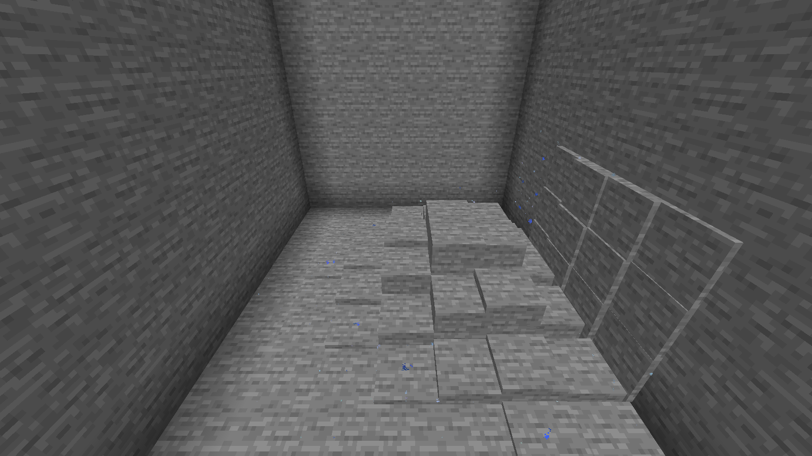

# Этап 1: вертикальный срез

Сущность живёт в `SavedData` измерения, ползает по «коже» мира по графу поверхности, ныряет сквозь тонкую породу,
а клиент рисует её бугор по сетевому состоянию с интерполяцией.

## Критерий готовности (SPEC 15) — проверен в игре

> В пещере сущность, отправленная командой с потолка в точку на полу, плавно сползает по стене и едет по полу,
> бугор виден и не дёргается; по воздуху она не проходит никогда.

Сценарий [autotest/stage1-cave.txt](../autotest/stage1-cave.txt): каменный зал 37×11×31 под площадкой,
`/tremor spawn` на потолке у восточной стены, `/tremor goto` в точку на полу посередине зала.

Кадры той же серии (каждые ~0.8 с): бугор на потолке у угла (зелёные частицы — построенный маршрут по стене и полу),
на стене, у основания стены, на полу, уходит по полу.

Что показал `/tremor info` по ходу (выдержки из отчёта прогона):

| Момент | Позиция | Нормаль |
|---|---|---|
| старт на потолке | 22.5 51.5 28.5 | (0, −1, 0) |
| на стене | 27.5 44.0 28.5 | (−1, 0, 0) |
| на полу | 21.2 39.5 28.5 | (0, 1, 0) |
| прибыл | 8.5 39.5 28.5 | (0, 1, 0) |

Маршрут 34.9 блока, 701 раскрытый узел A*, без нырков; прибытие точно в цель.

**Нырок.** Боковая камера соединена с залом только стеной толщиной 3 блока. `goto` в камеру дал маршрут с одним
нырком; бугор пропадает в стене (амплитуда → 0) и всплывает с другой стороны:

**«Не дёргается».** Скриптовый прогон [stage1-smooth.txt](../autotest/stage1-smooth.txt) меряет скорость центра
нарисованного бугра от кадра к кадру, пока сущность едет 28 блоков по прямой с крейсерской скоростью 3 блока/с:

| Кадров/с | Средняя скорость | Разброс (σ/среднее) | Скачок между соседними кадрами, p99 / макс. |
|---:|---:|---:|---:|
| 60 | 3.00 | 0.2% | 1.0% / 2.4% |
| 140 | 3.00 | 0.1% | 0.4% / 1.8% |
| ~4500 | 3.00 | 0.4% | 0.4% / 68% (один кадр) |

Рывок (прыжок к новому снимку, остановка часов) дал бы скачок порядка 100% и больше.

**Перепланирование на ходу** ([stage1-fixes.txt](../autotest/stage1-fixes.txt)). Новая цель позади сущности не
разворачивает её мгновенно: она тормозит по старому маршруту (не быстрее заданного ускорения), возвращается по нему
до общего узла и разгоняется по новому. Скачок скорости между кадрами за всё время разворота — не больше 13%.
Если новый маршрут уходит в ту же сторону (в пределах 45°), он подхватывается сразу, без торможения, с непрерывным
направлением.

**Короткий нырок.** Сквозь стену в 2 блока (нырок длиной 1): амплитуда начинает уходить заранее и к входу в породу
равна 0, внутри стены нормаль разворачивается на 180°, бугор всплывает с правильной стороны. Выдержка из `/tremor info`
каждые 4 тика:

| Тик | x | Амплитуда | Нормаль |
|---:|---:|---:|---|
| 640 | −8.9 | 1.29 | (0.14, 0.99, 0) |
| 652 | −10.2 | 0.26 | (0.66, 0.75, 0) |
| 656 | −10.7 | **0.00** (в породе) | (0.87, 0.49, 0) |
| 660 | −11.3 | **0.00** (в породе) | (−0.87, 0.49, 0) |
| 664 | −11.8 | 0.70 | (−0.87, 0.49, 0) |
| 680 | −13.7 | 1.87 | (−0.28, 0.96, 0) |

**По воздуху — никогда.** Это свойство графа: рёбра «по коже» требуют непрерывности открытого пространства с обеих
сторон и твёрдого угла на диагоналях, нырки — только сквозь известную твёрдую породу. Проверено тестами на
синтетических сценах и случайных сетках (`SurfaceGraphTest`, `SurfacePathIntegrationTest`).

## Производительность

* Сервер: среднее время тика сущности 0.03–0.07 мс во время движения (бюджет SPEC 16 — 0.5 мс). Тики, в которых
  идёт поиск пути (500 узлов за тик), — до 2–8 мс; поиск распределён по тикам.
* Пакет состояния ≈ 80 байт, 10 раз в секунду игрокам в радиусе 160 блоков; форма бугра — отдельным пакетом при
  изменении.
* Клиент: ~0.08 мс/кадр на рендер бугра (50 копий). Поверхность собирается только в радиусе, где бугор может стать
  выше порога отрисовки (7 блоков при параметрах по умолчанию, а не 13 по радиусу следа), копии запекаются лениво —
  не больше 48 за кадр.

## Команды

| Команда | Что делает |
|---|---|
| `/tremor spawn [pos]` | Создать сущность (одна на измерение) у взгляда или в точке; точка «прилипает» к ближайшей поверхности. |
| `/tremor despawn` | Убрать. |
| `/tremor goto [pos]` | Отправить в точку (поиск пути распределён по тикам). |
| `/tremor set` | Показать параметры; `set <param> <value>` — изменить для сущности; `set reset` — вернуть конфиг. |
| `/tremor info` | Состояние, маршрут, стоимость тика. |
| `/tremor debug <path\|normals\|graph> <on\|off>` | Частицы: маршрут, нормали, узлы и рёбра графа. |

## Устройство

* `tremor.core.voxel.VoxelCache` — кэш твёрдости по секциям 16³ поверх мира.
* `tremor.core.graph.SurfaceGraph` — граф поверхности (ленивый, с запоминанием по вокселю и инвалидацией).
* `tremor.core.path.PathSearch` — инкрементальный A* с лимитом узлов; `PathSpline` — центростремительный
  Catmull-Rom по длине дуги.
* `tremor.core.motion.Crawler` — движение по сплайну с ограничением ускорения, сглаживание нормали и амплитуды.
* `tremor.entity` — состояние сущности, `SavedData`, тик и синхронизация, инвалидация по событиям изменения блоков.
* `tremor.client.ClientTremor` / `SnapshotPlayback` — буфер снимков и интерполяция (Эрмит по скоростям).
* `tremor.client.render.DeformationRenderer` — рендер этапа 0, переделанный под движущийся бугор.

## Ревью

Код этапа прошёл ревью (4 направления, каждая находка перепроверена отдельным агентом): подтверждено 10 проблем,
все исправлены и покрыты тестами — разворот нормали на 180° после нырка, непрерывность скорости и направления при
перепланировании, сохранение нырка при перепланировании внутри породы, заблаговременное погружение перед коротким
нырком, согласованность кэша местности и графа (в том числе после подгрузки чанка), повторное отслеживание маршрута
после сброса кэша, длинные нырки (`maxDiveDepth` ≥ 6), переполнение точности фазы анимации, лишнее запекание копий.
Юнит-тестов: 186.

Спайк этапа 0 (`/tremor spike`, `block_display`) удалён, его результаты — в [stage0-render-spike.md](stage0-render-spike.md).
