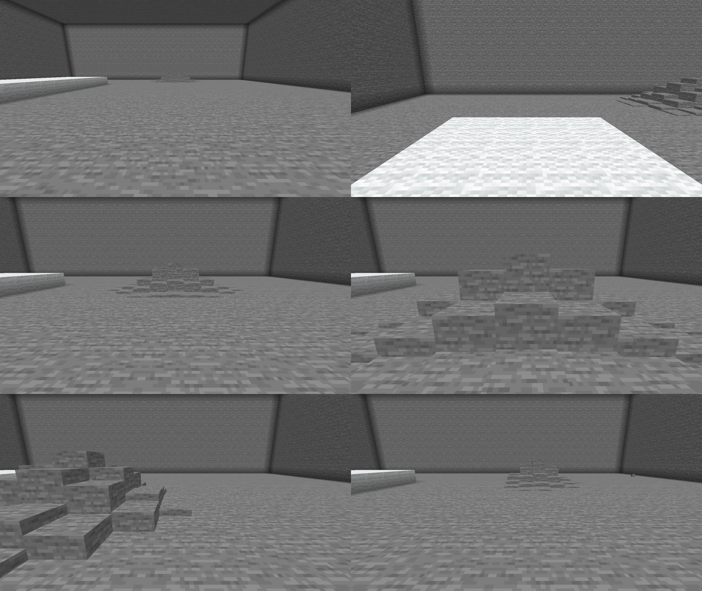

# Этап 2: слух

Сущность слышит вибрации через землю: шаги, прыжки, копание, падения, приземлившиеся снаряды и предметы, взрывы.
Чем лучше путь звука проводит вибрацию, тем дальше она слышна; изоляция под ногами глушит шаги.

## Критерий готовности (SPEC 15) — проверен в игре

> Игрок, идущий по камню, притягивает бугор; на корточках или по шерстяному настилу — нет; брошенный снежок
> уводит бугор в сторону.

Сценарий [autotest/stage2-hearing.txt](../autotest/stage2-hearing.txt): каменный зал, сущность ждёт в дальнем конце
(22 блока), «игрок» ходит удержанием клавиш. Строки ниже — из отладочного вида `/tremor debug hearing`
(L — громкость, footing — проводимость опоры, d — расстояние, res — среднее сопротивление пути).

| Что делает игрок | Строка слуха | Итог |
|---|---|---|
| крадётся по камню | шаги не порождают вибраций (L = 0) | не слышно, бугор на месте |
| идёт по шерстяному настилу | `step L=2.0 footing=0.10 d=17–25 → 0.00 / 0.10` | не слышно |
| идёт по камню | `step L=2.0 footing=1.20 d=22.0 res=0.83 → 0.12 / 0.10 HEARD` | бугор ползёт к игроку |
| бежит по камню | `step L=4.0 footing=1.20 d=15 → 0.35 / 0.10 HEARD` | громче шага |
| стоит; снежок падает в 17 блоках в стороне | `projectile_land L=4.0 footing=1.20 d=21.5 → 0.25 HEARD` | бугор уходит к снежку |
| стоит; блок падает на пол с другой стороны | `item_land L=4.6 footing=1.20 d=20.4 → 0.31 HEARD` | бугор уходит к блоку |

Кадры прогона по порядку: старт (бугор вдали); после прогулки по шерсти — на месте; после шагов по камню — ползёт
и оказывается прямо перед игроком; снежок уводит его влево; упавший блок — вправо.

## Как устроено

**Формула** (SPEC 7.2): `воспринято = громкость · опора / (1 + расстояние · среднее сопротивление)`.
Сопротивление вокселя — `1 / проводимость`, среднее берётся по точкам через 0.5 блока вдоль отрезка от точки входа
вибрации в землю до сущности (не больше 128 точек). Слышно, если результат не меньше порога (0.1).

**Проводимость** задаётся тегами блоков и конфигом (`hearing.conductivity`):

| Класс | Тег | Значение |
|---|---|---:|
| изолирующий: шерсть, ковры, листва (листва под ногами шелестит, см. ниже) | `#tremor:conductivity/insulating` | 0.1 |
| дерево: доски, брёвна, деревянные плиты, ступени, заборы, двери; бамбуковая мозаика; приставные лестницы, строительные леса; верстаки, сундуки, бочки | `#tremor:conductivity/wooden` | 0.4 |
| гравий | `#tremor:conductivity/gravelly` | 0.4 |
| песок, песок душ, снег (и рыхлый) | `#tremor:conductivity/sandy` | 0.7 |
| камень и кладка: камень, сланец, туф, руды, бедрок, обсидиан, кирпичи, песчаник, призмарин, кварц, пурпур, терракота, бетон, аметист, магма; все прочие плиты, ступени и ограды; блоки металлов и минералов | `#tremor:conductivity/stony` | 1.2 |
| прочее твёрдое (земля) | — | 1.0 |
| вода и другие жидкости | — | 0.3 |
| воздух и прочее без коллизии (трава, цветы, лианы) | — | 0.05 |

Класс блока — первый подходящий тег сверху вниз. Дерево проверяется раньше камня: камень берёт `#minecraft:slabs`,
`#minecraft:stairs` и `#minecraft:walls` целиком, а деревянные плиты и ступени входят в них же, но остаются деревом.

Модпаки могут дополнять теги своими блоками.

**Источники** (SPEC 7.1): ванильные `GameEvent`-ы через `VanillaGameEvent`. Громкости по умолчанию: шаг 2, бег 4,
приземление 5, падение с уроном 10 + высота, ломание блока 6, установка 4, снаряд упал 4, предмет упал 3–5
(по скорости удара), копыта/вагонетка 6, взрыв 20 (и +20 к агрессии). Таблица `hearing.loudness` в конфиге.

* Шаги и приземления на корточках — 0 (ванильный скалк их тоже игнорирует). Бег поднимает громкость шагов, но не
  приземлений.
* Приземлением считается `hit_ground` после перепада не меньше 0.9 блока (прыжок на ровном месте — около 1.25, шаг
  с блока — 1.0). Мелкие перепады (спуск по ступеням и плитам) — это шаги, они уже услышаны.
* Опора — блок, на котором стоит источник: ковёр или слой снега, если игрок стоит на нём, иначе блок под ногами.
  На лестнице, строительных лесах и в рыхлом снегу — сам этот блок; лианы передают вибрацию в лучший проводник
  среди соседних блоков (стену, на которой висят). В воде или в лодке громкость ×0.2, в воздухе — 0.
* **Шелест** (этап 4d, SPEC 7.2): листва под ногами (тег `#tremor:rustling`, по умолчанию `#minecraft:leaves`) не
  глушит, а шумит — опора `hearing.rustlingFactor` = 1.5, громче камня (1.2). Листва, в которой шуршит источник, звук
  по пути не гасит: точки отрезка от источника, пока они лежат в листве, проводят как опора. Листва дальше по пути,
  за чем-то другим, — по-прежнему изолятор (0.1): полоса листвы между игроком и сущностью глушит шаги. Сценарий
  [stage4d-reach-leaves](../autotest/stage4d-reach-leaves.txt), сущность в 15 блоках: шаг по камню
  `footing=1.20 → 0.17–0.18`, по полосе листвы и по полу из листвы `footing=1.50 → 0.21–0.23 (rustling)`, по камню с
  полосой листвы на пути `res=2.0–2.3 → 0.07–0.08 not heard`.
* Падение всадника засчитывается один раз — по корневому транспорту, с земли под ним. Лошади, верблюды и ламы
  не порождают событие падения: их `hit_ground` после перепада больше безопасной высоты (6) считается падением.
* Мобы по умолчанию не слышны (`mobLoudnessFactor = 0`): сущность охотится на игрока, а не на коров. Снаряды и
  упавшие предметы слышны всегда — это приманки (SPEC 7.4).

**Реакция** (SPEC 7.3, состояние на конец этапа 2): услышанное обновляет «последний звук», добавляет к агрессии
`воспринято · angerPerLoudness` и становится целью. Цель меняется не чаще раза в 10 тиков, если новый звук не громче
текущего в 1.5 раза. Звук, до которого нет пути, бросается тихо (лог DEBUG); тот же звук из той же точки не ищется
снова 100 тиков в радиусе 4 блоков. Остановка (отказ от цели, `/tremor stop`) — торможение вдоль текущего пути
с ограничением ускорения, никогда не внутри породы. `/tremor goto` важнее звуков, пока не достигнут. С этапа 3 решения
о цели принимает «мозг» по стадиям агрессии — см. [stage3](stage3-aggression.md).

## Отладка

* `/tremor debug hearing on` — частица в точке входа вибрации в землю (зелёная — услышан, красная — нет) и строка
  над хотбаром со всеми слагаемыми формулы; шаг по листве помечен `(rustling)`.
* `/tremor info` — агрессия, последний звук (событие, место, громкость, сколько секунд назад), вид цели
  (manual / sound).
