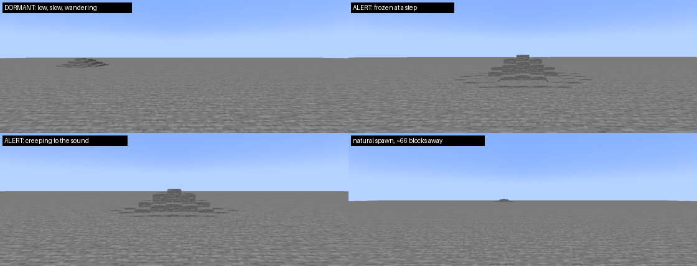
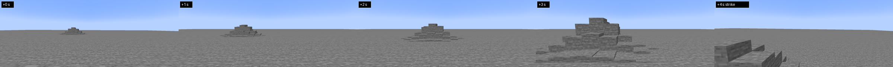
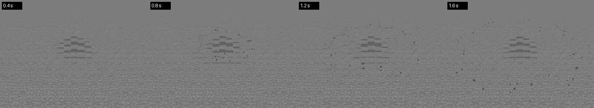

# Этап 3: агрессия, стадии, естественный спавн

У сущности появилась шкала агрессии и четыре стадии поведения. Она сама появляется вдалеке от игрока, блуждает,
настораживается на шум, охотится, бьёт при контакте, успокаивается в тишине и уходит, если долго ничего не
происходит.

## Критерий готовности (SPEC 15) — проверен в игре

> В выживании сущность сама появляется вдалеке, реагирует на шум по стадиям, её можно «разозлить» и «успокоить»
> тишиной.

Сценарий [autotest/stage3-aggression.txt](../autotest/stage3-aggression.txt): каменная платформа 161 × 161 блок
высоко в небе (больше уползти некуда, всё на виду). Игрок в режиме выживания стоит в центре. Ниже — строки из
отчёта прогона.

| Шаг | Что видно в отчёте | Итог |
|---|---|---|
| Сущность в покое, игрок стоит | `dormant: wandering`, цели `roam` в 16–32 блоках, не ближе 24 к игроку | лениво блуждает в поле зрения, бугор низкий (1.2), скорость 1.8 б/с |
| Игрок ходит по камню (9 заходов) | `anger +0.8 = 25.2, dormant -> alert: freezes` | шаги злят; на 25 — тревога |
| Шаги продолжаются | `alert: frozen 2.3 s`, затем `alert: creeping to the sound` | замирает на каждый шаг, потом крадётся к звуку |
| Снежок в 5 блоках | `projectile_land ... 0.93 HEARD, alert: freezes` | замирает, поворачивается к звуку, по земле бежит рябь |
| Игрок бежит (4 захода) | `anger +1.3 = 60.8, alert -> hunting: hunts` | охота: бугор выше (2.5), скорость 4.8 б/с |
| Бугор доходит до игрока | здоровье 20 → 16 → 9.7, агрессия 76 → 99.9 | удар, отбрасывание, сильный рост агрессии |
| Игрок на недосягаемом уступе, тишина | `hunting: searching` → 73 → `alert` 43 → `dormant` 13 → 0 | рыщет вокруг, теряет интерес, за ~70 с успокаивается |
| Проверки спавна раз в секунду, шанс 1 | `Natural; ...` через ~11 с, в 66 блоках | сущность сама появляется вдалеке, на виду |
| Порог тишины 5 с, кулдаун 600 с | сущность исчезает; 20 с спустя новой нет | уходит, кулдаун держится |
| `/tremor spawn natural` | `spawned naturally at 369, 200, 309, 69.6 blocks away (visible, near the way ahead)` | точка спавна находится сразу |

Стадии и естественный спавн (кадры прогона):

Охота: от перехода в HUNTING до удара проходит около 4 секунд, бугор вырастает и бьёт игрока у ног.

Рябь при замирании ([autotest/stage3-ripple.txt](../autotest/stage3-ripple.txt), вид сверху, через сколько секунд
после звука): от бугра расходится кольцо, вдоль фронта поднимается пыль.

## Как устроено

**Шкала** (SPEC 8, `behavior` в конфиге): агрессия 0..100. Услышанный звук добавляет
`воспринято · angerPerLoudness` (6), взрыв ещё +20, удар по игроку +15. Спад — 0.5 в секунду; если 20 секунд ничего не
слышно, то втрое быстрее. Пороги: тревога 25, охота 60, пробуждение 100. Вниз стадия меняется с гистерезисом 3:
охота держится, пока агрессия не упадёт ниже 57.

**Стадии** (решения принимает «мозг», `tremor.core.behavior.Brain`; тело его слушается):

| Стадия | Поведение | Скорость | Высота бугра |
|---|---|---:|---:|
| DORMANT | блуждает: пауза ~4 с, затем точка в 16–32 блоках; предпочитает точки, которые видит ближайший игрок, но не ближе 24 к нему. Идёт только на громкие звуки (≥ 0.35) | ×0.6 | ×0.6 |
| ALERT | на каждый звук замирает на 2.5 с, поворачивается фронтом к звуку, по земле идёт рябь; потом крадётся к месту звука. 12 с тишины — снова блуждает | ×0.5 | ×0.85 |
| HUNTING | идёт прямо на каждый звук; не найдя никого, 20 с рыщет в радиусе 8 блоков вокруг, ждёт нового звука. Контакт с игроком — удар | ×1.6 | ×1.25 |
| AWAKENING | до этапа 4 ведёт себя как HUNTING (в лог пишется, что событие ещё не готово) | ×1.6 | ×1.25 |

Множители умножают `movement.speed` (3 б/с) и `shape.amplitude` (2 блока); высота меняется плавно.

**Переходы** слышны (SPEC 8, 13): вверх до тревоги — гул (`rumble`), до охоты — треск породы (`crack`) с низким гулом,
до пробуждения — `awaken`, любой спад — «вздох» земли (`sigh`). Звуки играются в точке бугра; новое состояние
уходит игрокам в том же тике.

**Рябь** (ALERT): при замирании от бугра по поверхности расходятся два кольца (5 б/с, длина волны 3, высота до
0.35 блока, 3 с). Пока рябь идёт, новая не начинается, поэтому кольца успевают разойтись и под непрерывные шаги.
Во время нырка ряби нет. Клиент рисует её той же деформацией, что и бугор, и гасит вместе с бугром. Одна
геометрия читается слабо (серый камень на сером), поэтому вдоль фронта поднимается пыль из частиц самого
блока поверхности. Пыль учитывает настройку частиц и отключается в клиентском конфиге (`effects.rippleDust`).

**Шорох** (SPEC 13): зацикленный звук движения бугра. Громкость зависит от скорости и стадии (охота громче всего,
тревога тише всего), тон — от стадии. Слышен в пределах ~20 блоков и запускается заново при каждом приближении,
чтобы показался субтитр.

**Удар** (SPEC 8, HUNTING и AWAKENING): игрок, чьё тело (ноги, середина, глаза) оказывается в бугре радиусом 1.6
с открытой стороны поверхности. Сквозь стену или перекрытие удара нет. Удар срабатывает не чаще раза в секунду:
4 урона типа `tremor:tremor` («поглотила земля»; щитом не блокируется), отброс 0.9 и подъём 0.45 с учётом
сопротивления отбрасыванию, +15 агрессии. После удара «мозг» слышит игрока и продолжает охоту. Творческий режим
и наблюдатель не задеваются.

**Естественный спавн** (SPEC 11, раздел `spawn`): каждые 30 с у каждого игрока в разрешённых измерениях (по
умолчанию только Overworld) идёт проверка, игроки распределены по времени. Первая проверка — через 60 с после
входа. Шанс — 0.04 × множители: пещера ×2.5 (неба не видно, листва и вода крышей не считаются), темнота ×2
(свет < 7), глубина ×1.5 (y < 0), ночь ×2. Точка выбирается на поверхности в 40–80 блоках от игрока и должна быть
видна ему (линия взгляда и в пределах его дальности прорисовки) или лежать на его пути (полоса ±10 блоков вперёд
по направлению движения). Спавна нет:
* в мирном режиме;
* в творческом режиме и режиме наблюдателя;
* в 32 блоках от точки спавна мира и от кроватей/якорей;
* в течение 600 с после ухода предыдущей естественной сущности.

**Уход** (SPEC 11): естественная сущность уходит, если рядом (96 блоков) нет игрока 120 с или если 600 с ничего не
происходит (не слышно звуков, стадия DORMANT). Бугор опускается в землю, затем сущность исчезает и начинается
кулдаун. Если её чанк выгружен, часы тикают дальше, и она исчезает сразу, без анимации. Сущности, вызванные
командой, сами не уходят.

## Команды (SPEC 14.1)

* `/tremor anger <0..100>`, `/tremor stage <dormant|alert|hunting|awakening>` — выставить агрессию или стадию (со
  звуком перехода).
* `/tremor ai <on|off>` — включить или выключить «мозг». Без него сущность слушается только `goto` и `stop`, но шкала
  и множители стадий работают. Сценарии этапов 1–2 выключают его.
* `/tremor spawn natural` — сразу найти естественную точку спавна для себя (без шанса и кулдауна).
* `/tremor info` — плюс стадия, агрессия, что делает «мозг», часы ухода естественной сущности.
* `/tremor debug hearing on` — строка слуха показывает прибавку агрессии, смену стадии и реакцию.

## Производительность

Серверный тик сущности в прогоне: в среднем 0.05–0.07 мс (бюджет SPEC 16 — 0.5 мс); пики до 2–4 мс, когда
выбирается точка блуждания по новой местности (до 48 лучей видимости и чтение секций). Поиск точки естественного
спавна — 0.2–2.8 мс один раз на удачный бросок.

## Автотесты

* Харнесс получил команды `config <путь> <значение>` (меняет конфиг на время прогона и откатывает его в конце) и
  `waitfor <тики> <regex>` (ждёт строку в чате). Если игрок умер, харнесс сам его возрождает и пишет ошибку
  в отчёт.
* Сценарии этапов 1–2 обновлены под этап 3: `tremor ai off` и нейтральные множители стадии DORMANT (этап 1),
  `tremor anger 45` (этап 2: в покое тихие шаги игнорируются по SPEC 8).
