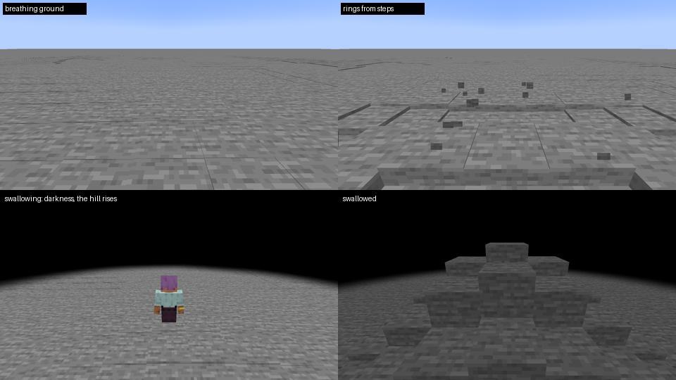
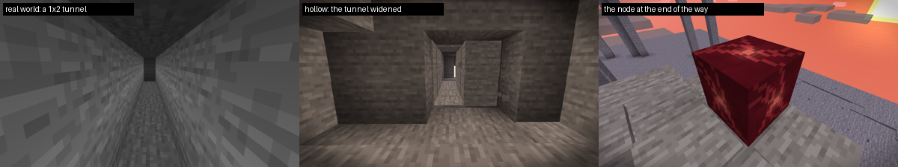
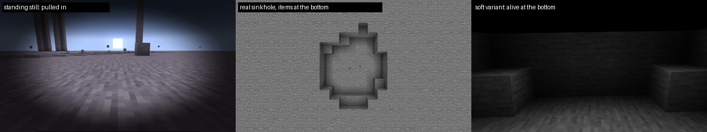
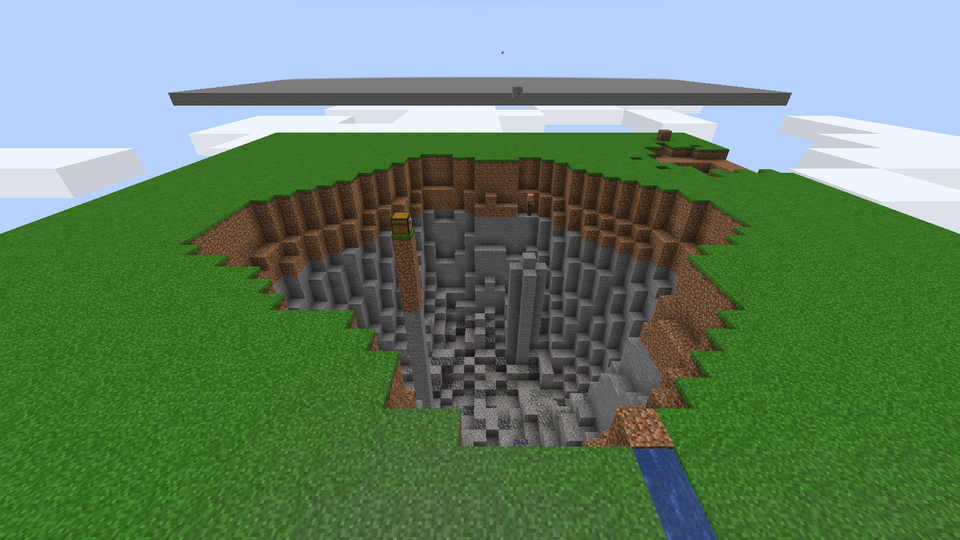
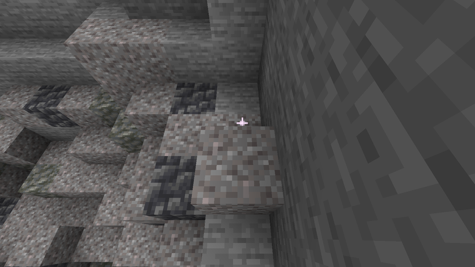
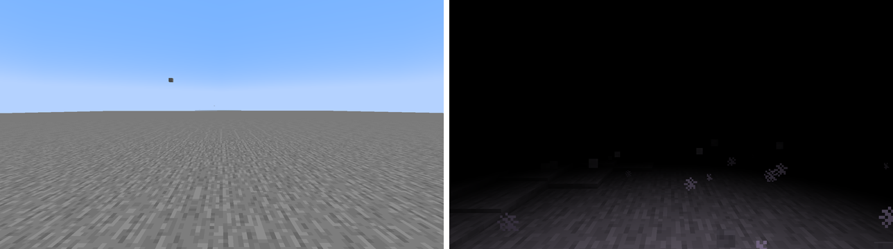
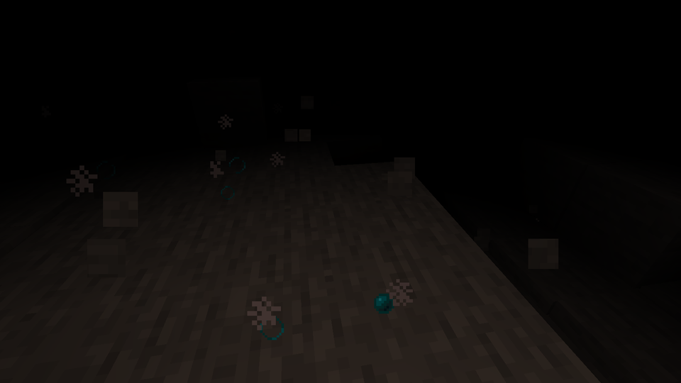
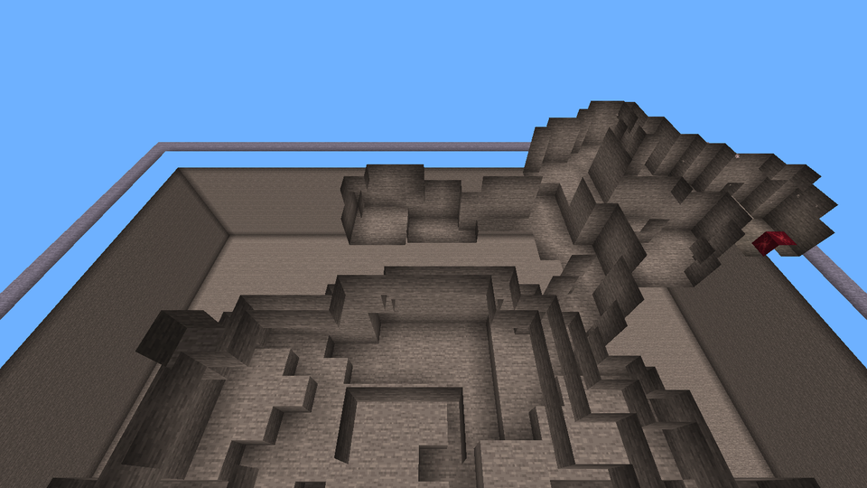
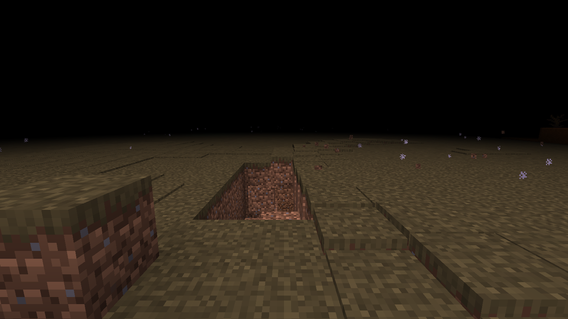

# Этап 4: Пробуждение

Решение, принятое вместе с автором (SPEC 9): противостояние идёт не в реальном мире, а в **изнанке** — копии
окружающей местности в отдельном измерении `tremor:hollow`. Реальный мир во время события не меняется. Этап разбит на
четыре части; 4d — доработка после того, как автор поиграл в 4a–4c:

| Часть | Что | Статус |
|---|---|---|
| 4a | Изнанка: измерение, участки, копирование, перенос с затемнением, возврат после выхода из игры | готово |
| 4b | Нарастание в реальном мире: зона, тишина, дыхание, рябь от шагов, побег, поглощение | готово |
| 4c | Изнанка как уровень: узел, смыкание, затягивание, исходы, провал при поражении | готово (провал заменён кратером в 4d) |
| 4d | Начало, только когда сущность добралась до игрока; тьма в изнанке; сеть ходов к узлу; кратер с тайниками; шелест листвы | готово, проверено в игре |

Разделы 4a–4c описывают то, что было сделано на своих частях; что из этого 4d изменила, помечено в тексте.

## 4a. Изнанка

Проверено в игре сценариями [autotest/stage4a-hollow.txt](../autotest/stage4a-hollow.txt) и
[stage4a-relog-1/2](../autotest/stage4a-relog-1.txt):

| Проверка | Результат |
|---|---|
| `/tremor hollow enter` в каменном зале | экран гаснет, копия 65 × 49 × 65 блоков (229 тыс.) готова за 22 тика: 121 мс серверного времени, худший тик 12 мс; игрок в `tremor:hollow` в той же точке |
| Копия выглядит как оригинал | те же блоки, свет и биомы; изнанка застыла в сумерках и чуть темнее (с 4d — чёрный туман и нет неба) |
| `/tremor hollow leave` | экран гаснет, игрок в обычном мире ровно на исходном месте, участок изнанки очищается (~45 тиков) |
| `/tremor restore` | все события завершены, игроки возвращены |
| Выход из игры внутри изнанки, затем вход | игрок сразу в обычном мире в исходной точке, событие закрыто, участок очищен |

**Как устроено.**

* **Измерение `tremor:hollow`.** Пустой плоский мир (без слоёв, биом `the_void`), высота как у обычного мира. Время
  застыло в сумерках. Кровати и якоря не работают, мобы не появляются. С 4d у измерения свои эффекты
  (`"effects": "tremor:hollow"`): неба, солнца, луны, звёзд, облаков и погоды нет, а клиент закрывает всё дальше
  ~5 блоков чёрным туманом (см. 4d).
* **Участки.** Каждое событие получает свой участок, далеко от остальных (спираль вокруг центра границы мира, шаг 64
  чанка). Смещение — целые чанки по горизонтали, высота та же, поэтому координаты копии и оригинала совпадают с
  точностью до сдвига. Пока идёт событие, чанки участка держатся загруженными.
* **Копирование.** Работа идёт кусками 16×4×16 в пределах 5 мс за тик (с 4d эти 5 мс общие для копирования,
  подготовки уровня и очистки всех событий). Блоки пишутся прямо в секции чанков: при этом песок не падает, вода не
  течёт, механизмы не срабатывают. Высоты, свет, точки интереса и биомы обновляются как после `/fill`. Из реального
  мира читаются только загруженные чанки, незагруженное становится камнем. Вокруг копии — оболочка: в пещерах камень,
  над поверхностью воздух. Порталы в копии становятся воздухом.
* **Перенос.** Экран темнеет, пока идёт копирование. Игрок переносится в ту же точку участка после того, как копия и
  свет готовы, а экран светлеет, когда клиент получил чанки вокруг. Обратно — так же, с поиском свободного места рядом
  с исходной точкой. Клиент сам снимает затемнение на экране смерти, при возрождении и через 60 с без сигнала
  сервера.

**Правила изнанки: копии — муляжи, всё игрока возвращается ему.**

* **Копии — муляжи.** Сломанная копия ничего не даёт, в том числе от взрыва и падения. Сундуки, печи, верстаки и
  прочее не открываются и не работают. Из копий нельзя набрать воду или лаву вёдрами, обработать их инструментами или
  наловить рыбу. Порталы не работают, молний нет.
* **Блоки, которые поставил игрок, — его.** Они ломаются с обычным выпадением. Всё, что осталось к концу события
  (вместе с содержимым шалкеров и сундуков), выпадает там, куда игрок вернулся. Туда же уходят все предметы и опыт,
  оставшиеся в изнанке.
* **Существа игрока не пропадают.** Попугай с плеча и питомцы возвращаются в реальный мир, ведра с мобами и яйца
  призыва в изнанке не используются.
* **Ограничения.** Лодки, вагонетки, стойки для брони, рамки, картины, воронки, раздатчики и т.п. ставить нельзя.
  Строить можно только в пределах своего участка.
* **Вход и выход.** Попасть в изнанку можно только через событие: порталы, жемчуг и телепорт сюда отменяются. Любой
  игрок, оказавшийся в изнанке без своего события, сразу возвращается.
* **Выход из игры.** Точка возврата хранится в файле игрока. Если игрок вышел внутри изнанки или сервер упал, при
  входе он оказывается на этой точке.

**Команды:** `/tremor hollow enter | leave | status`, `/tremor restore`.

## 4b. Нарастание в реальном мире

Проверено сценарием [autotest/stage4b-buildup.txt](../autotest/stage4b-buildup.txt) на небесной платформе: побег
за край зоны и поглощение с переходом в изнанку, оба раза событие закрывается, сущность уходит вглубь.

* **Начало.** На 4b событие начиналось сразу, как только агрессия доходила до 100, для игрока, чей звук сущность
  услышала последней. **Заменено в 4d:** на пике сущность сначала ищет игрока, и событие начинается, только когда её
  бугор добрался до него (8 блоков); не нашла никого за 35 с — успокаивается (см. 4d). Творческий режим, режим
  приключения и наблюдатель не в счёт. Для отладки есть `/tremor awaken [игрок]` (сразу, без поиска) и
  `/tremor awaken stop`.
* **Зона** — 30 блоков вокруг игрока. Сущность «становится всей округой»: бугор уходит в землю, мозг замирает.
* **Дыхание.** Земля зоны (полы, стены и потолки в пещерах) медленно поднимается и опускается с периодом 5 с.
  Подъём растёт к концу нарастания и идёт неровными пластами, иначе ровный пол поднимался бы весь разом и движения
  не было бы видно. У края зоны дыхание затухает.
* **Рябь от шагов.** Каждый шаг игрока в зоне (кроме крадущегося) пускает по земле кольцо с пылью. Чем громче шаг, тем
  сильнее волна.
* **Тишина.** Все звуки мира (мобы, погода, шаги, музыка) за 3 с стихают почти до нуля. Остаются сердцебиение, которое
  учащается с 1,1 до 0,45 с, и низкий гул. Последнюю треть нарастания на игрока накатывает вспышками тьма.
* **Побег.** Вышел за край зоны — событие окончено, земля «вздыхает» и успокаивается, сущность уходит вглубь.
  Естественный спавн в измерении блокируется на 3600 с.
* **Поглощение.** Не вышел — игрока сковывает (без урона от падения, без сбрасывания с транспорта над лавой), под ним за
  2,5 с вырастает холм, экран темнеет, игрок оказывается в изнанке. Для остальных земля сразу разглаживается.

Стоимость отрисовки на пике дыхания (плоская зона 30 блоков, 1600×900): кадр в среднем 1,0 мс, p99 2,0 мс.

## 4c. Изнанка как уровень и исходы

Проверено сценариями [autotest/stage4c-victory.txt](../autotest/stage4c-victory.txt) и `stage4c-edge-defeat.txt`
(на этапе 4d его заменили [stage4d-crater-defeat.txt](../autotest/stage4d-crater-defeat.txt) и
[stage4d-crater-edge.txt](../autotest/stage4d-crater-edge.txt)). Все четыре исхода, плюс побег в фазе нарастания (4b).
Таблица — состояние на конец 4c; с 4d узел в 40–60 шагах, а вместо провала кратер (см. 4d):

| Путь | Что видно в отчёте |
|---|---|
| Победа: поглощён в туннеле 1×2 | пещера раздвинута (вынуто 258 блоков), узел в 18 шагах в конце прокопанного прохода; узел разбит киркой, игрок вышел в точке поглощения, сущность ушла вглубь |
| Побег через край | дошёл до края изнанки, вышел в соответствующей точке реального мира (331.5, 201, 300.5) на твёрдой земле |
| Поражение | стоял на месте, земля затянула: «Dev was swallowed by the ground»; в реальном мире провал (87 блоков), меч и алмазы на дне |
| Поражение, мягкий вариант | очнулся живым на дне провала: 1 здоровье, слепота, тошнота, слабость, замедление |

**Подготовка изнанки** (пока экран тёмный):

* **Раздвигание тесноты.** Если вокруг игрока мало открытого пространства, вырастает пещера: неровный купол с
  бугристым потолком и полом. Под игроком всегда пол и 3 блока над головой. На 4c порог был 100 открытых блоков в
  8 блоках, а купол — радиусом около 5 блоков; **с 4d** порог 400 (`hollow.level.widenBelow`), а пещера около
  16 блоков в поперечнике и до 6 в высоту.
* **Узел** `tremor:heart_node` — пульсирующий красный блок. Ломается рукой за ~4 с, киркой быстрее; взрывы и поршни
  его не берут. Путь к узлу защищён: смыкание и сдвиги стен его не заполняют. Жидкости, вскрытые при раскопке,
  запечатываются. На 4c узел стоял в 14–24 шагах от игрока, на сухом месте, куда можно дойти (иначе к нему
  прокапывался туннель 2×3), и светил уровнем 11. **Заменено в 4d:** узел всегда в камере под землёй в 40–60 шагах,
  к нему ведёт сеть ходов с тупиками, а его свет (4) освещает только соседние блоки (см. 4d).
* **Дно копии сплошное**, провалиться в пустоту нельзя. Предметы и опыт, улетевшие за пределы копии, сразу
  возвращаются туда, куда выйдет игрок.

**Давление:**

* **Смыкание.** После 10 с отсрочки края изнанки закрываются внутрь со скоростью 0.08 блока/с плюс шум игрока (шаги
  по камню ~6, бег ~16 — с 4d бега в изнанке нет, крадучись 0): стены вспучиваются копиями соседней породы, сначала
  внешнее кольцо. Рядом с игроком (2 блока), на пути к узлу и на блоках игрока ничего не растёт. Прокопанное в
  заросшей части зарастает снова. Приманка (предмет или снаряд, упавший дальше 4 блоков от игрока) ставит смыкание на
  паузу на 4 с, не чаще раза в 8 с.
* **Ходящие стены.** Каждые 2 с три блока стен в 5–14 блоках от игрока меняются местами с соседним воздухом.
* **Пульс узла.** Удар раз в 30 тиков, к концу смыкания раз в 12: по поверхностям бежит кольцо, сердцебиение звучит
  из узла, громче ближе к нему. С 4d кольцо поднимает пыль, а сердцебиение слышно со всей изнанки (см. 4d).
* **Затягивание.** Простоял 3 с на месте (в пределах 0.25 блока) — земля под ногами размякает в `tremor:mire`
  (на любом грунте: плиты, тропинки, песок душ). Игрок проседает, края экрана темнеют, слышно чавканье. Двигаться в
  трясине тяжело, из глубокой ямы проще выкопаться. Ушёл — через 4 с земля снова твёрдая.

**Исходы:**

* **Победа** — узел разбит. Игрок выходит в точке поглощения, там поднимается холм и медленно оседает (фаза EMERGING,
  4 с), сущность уходит вглубь. **Переделано 2026-10-03:** выход — зеркало поглощения, игрок появляется уже внутри
  холма и удержан, пока холм выше глаз (см. «Выход из холма и корень»).
* **Побег через край** — игрок дошёл до края копии (в том числе прокопавшись или поднявшись выше её верха). Выход
  ищется на твёрдой земле рядом с соответствующей точкой реального мира, причём до точки поглощения оттуда можно
  дойти. Иначе игрок выходит в точке поглощения. **С 4d** у точки поглощения при этом всё равно открывается кратер
  (без вещей), а выход ищется вне его следа.
* **Поражение** — игрока затянуло целиком. На 4c в реальном мире у точки поглощения копался провал: неровная чаша
  радиуса 4 и глубины до 6, вещи погибшего лежали на его дне. **Заменено в 4d:** кратер радиусом ~12 и глубиной ~20,
  вещи — в тайниках из осыпи на дне (см. 4d). Как и провал, кратер не трогает блоки с содержимым, `#tremor:protected`,
  неразрушаемые блоки и зону спавна, не вскрывает пещеры и не впускает жидкости. Затем по умолчанию игрок погибает:
  урон не портит броню и не блокируется ею. Тотем бессмертия, творческий режим или `awakening.lethal = false` дают
  мягкий вариант: игрок очнётся на дне ослабленным, вещи при нём.
* Режим приключения в естественное Пробуждение не попадает: в нём нельзя разбить узел.

**Отладка:** `/tremor hollow status` (узел, радиус смыкания, шум, затягивание), `/tremor hollow tonode` (встать
рядом с узлом), `/tremor hollow outcome <victory|edge|defeat>`.

## 4d. Доработка: поиск игрока, тьма, сеть ходов, кратер

Решение, принятое вместе с автором после игры в 4c (2026-10-03, SPEC 8, 9, 15): изнанка оказалась слишком простой, а
ямка при поражении — слишком маленькой. Узел стоял в 14–24 шагах и светился, до него было несколько секунд бегом;
Пробуждение начиналось, как только агрессия доходила до 100, где бы игрок ни был, и переждать пик было нельзя; провал
радиуса 4 был слишком мал. Что изменилось:

* событие начинается, только когда сущность на пике **добралась** до игрока; затаиться и переждать пик — рабочая
  стратегия;
* в изнанке **тьма**: чёрный туман на ~5 блоков, бега нет, неба нет; узел ищут по сердцебиению и по кольцам ряби;
* к узлу в 40–60 шагах ведёт **сеть ходов** с тупиками, на открытой местности — вниз через «горло»;
* поражение и побег через край оставляют **кратер** около 25 блоков в поперечнике и 20 в глубину; вещи погибшего — в
  тайниках на дне, часть засыпана;
* **листва под ногами шелестит**: шаг по ней громче, чем по камню.

Проверено сценариями `stage4d-*` (ниже — строки из отчётов последних прогонов; номера прогонов —
`run-autotest/tremor-autotest/<номер>`):

| Сценарий (прогон) | Что видно в отчёте |
|---|---|
| [stage4d-reach-seeking](../autotest/stage4d-reach-seeking.txt) (20261003-194803) | тихий игрок в 35 блоках не найден: через 15 с (`seekSeconds` урезан) `hunting`, агрессия 77.6 и дальше спадает; игрок бежит по камню — сущность идёт на шаг со скоростью 6.3 б/с, добралась, событие началось |
| [stage4d-reach-hiding](../autotest/stage4d-reach-hiding.txt) (20261003-194525; части 1b, 1c — 20261003-212915) | закрытая хижина 3×3×3; открытое место в 20 блоках от сущности; шум, затем игрок молча перенесён на 14 блоков от места шума — все три раза 35 с поиска, `stage hunting`, `No Awakening here`. После успокоения игрок ещё 60 с в хижине: с `behavior.wanderKeepAway` (охота → тревога → покой) бугор и цели блуждания не ближе 49 блоков; без него — 66–88 блоков (случайно), здоровье 20 |
| [stage4d-reach-sneakaway](../autotest/stage4d-reach-sneakaway.txt) (20261003-195925; также 193950, 194345, 195746) | шаг бега в 50 блоках от сущности поднимает агрессию 99.5 до пика; игрок крадётся 12.8 блока на север или 13.0 на запад и замирает — сущность ищет у звука, успокаивается до `hunting`, события нет; игрок остался у места шума — `Awakening #1 (natural) for Dev` |
| [stage4d-reach-leaves](../autotest/stage4d-reach-leaves.txt) (20261003-194945) | шаг по камню `footing=1.20 → 0.17–0.18`; по полосе листвы и по полу из листвы `footing=1.50 → 0.21–0.23 (rustling)`; по камню с полосой листвы на пути `res=2.0–2.3 → 0.07–0.08 not heard` (порог 0.10) |
| [stage3-aggression](../autotest/stage3-aggression.txt) (20261003-195251) | этап 3 по-прежнему проходится: части 4–5 теперь в режиме приключения (его событие не забирает), удар 20 → 16 → 14, `awakening: going for the sound`, затем спад до `dormant`; естественный спавн и уход |
| [stage4d-crater-dig](../autotest/stage4d-crater-dig.txt) (20261003-201300) | `/tremor crater` под холмом в 29 блоков с дубом в 26: слои от 230 до 181, над следом ничего не висит; 26–30 блоков в поперечнике, осыпь на дне на 18–19 блоков ниже точки поглощения; прыжки к стенам с пяти сторон — не выше 188.5 из 201; сундуки на столбах; вода и лава заткнуты пробками, стены земли в кратере нет, ручей, где стоял игрок, прорезан; житель и треска перенесены из засыпаемых клеток и живы; тайник: разбит — высыпал, заменён командой — пуст, `/clone ... move` — не удвоился, поршень его не двигает |
| [stage4d-crater-defeat](../autotest/stage4d-crater-defeat.txt) (20261003-200516) | «Dev was swallowed by the ground»; на дне 6 тайников, часть засыпана; один разбит рукой, пять — `setblock ... destroy`: 7 алмазов, меч, 16 хлеба, 64 факела, 1280 булыжника, нагрудник, щит — всё на месте (шлем с проклятием утраты пропал, как в ванилле), свободных предметов нет. Мягкий вариант: здоровье 1, еда 6, насыщение 0, через 20 с здоровье всё ещё 1. `/tremor restore` посреди копки: игрок опущен на слой ниже (y 190 вместо 201), здоровье 20, без падения. Смерть во время копки: «3 stacks hidden in 3 caches» |
| [stage4d-crater-edge](../autotest/stage4d-crater-edge.txt) (20261003-201012) | побег через край: выход в 31 блоке от точки поглощения (след кратера — 19), вещи при игроке, кратер без вещей; с радиусом 20 — выход в 30 блоках (след 29), вынуто ~9 тыс. блоков; победа кратера не оставляет (20139 блоков до и после) |
| [stage4d-crater-relog-1/2](../autotest/stage4d-crater-relog-1.txt) (20261003-200845, 200934) | выход из игры посреди копки кратера; при входе игрок в точке поглощения на 12 блоков ниже, на земле, здоровье 20, алмазы при нём |
| [stage4d-search-tunnel](../autotest/stage4d-search-tunnel.txt) (20261003-203107) | туннель 1×2 раздвинут (32 открытых блока) в пещеру 16 × 17 × 8; узел в 44 шагах, 22 блока по прямой, под землёй, 3 тупика, 3 попытки, подготовка 44 мс за 7 тиков; путь пройден, узел разбит, игрок вышел в точке поглощения. Туннель 3×3 — 41 шаг, комната 6×6×3 — 49. Смыкание до радиуса 6: путь (43 шага) открыт и пройден |
| [stage4d-search-open](../autotest/stage4d-search-open.txt) (20261003-203320) | у спавна: горло в 7.6 блока, одно ложное горло, узел в 40 шагах под землёй; естественный рельеф: горло в 4.1 блока, два ложных, 47 шагов, после смыкания до радиуса 6 путь пройден; небесная платформа: `NOT under the ground (nowhere deep enough)` — земли под ней нет, статус говорит это честно |
| [stage4d-search-cave](../autotest/stage4d-search-cave.txt) (20261003-203632) | кольцевая пещера с лавой вокруг старта: каждый ход через неё — закрытый каменный коридор; пол стартовой пещеры над магмой — камень; 42 шага, путь пройден |
| [stage4c-victory](../autotest/stage4c-victory.txt) (20261003-203505) | каменный блок увеличен до 63 × 63 × 37 под сеть ходов; узел в 41 шаге, разбит, игрок вышел в точке поглощения |
| [stage4d-dark-fog](../autotest/stage4d-dark-fog.txt) (20261003-192037; с Sodium 195116) | за 40 тиков в реальном мире шагом 8.37 блока, бегом 10.89; в изнанке бегом 8.30 (бег 0 тиков из 40); прыжки с бегом 5.31 против 6.64 шагом; двойное «вперёд» с прыжком на втором нажатии — 2.97 блока, как простой прыжок (в контрольном прогоне без блокировки — 4.27); под водой 2.55 / 2.30 и туман как на воздухе; кадр в тумане 0.27 мс в среднем, p99 0.65; после выхода бег снова 10.89. С Sodium те же числа |
| [stage4d-dark-rings](../autotest/stage4d-dark-rings.txt) (20261003-193007) | кольца на открытом месте и в пещере; в полной темноте без ночного зрения вдоль гребня — тусклые бирюзовые искры, на освещённой земле — ни одной; кадр 0.25–0.31 мс; после победы бег вернулся |
| [stage4b-buildup](../autotest/stage4b-buildup.txt), [stage4a-hollow](../autotest/stage4a-hollow.txt), [stage4a-relog-1/2](../autotest/stage4a-relog-1.txt) (20261003-204514, 204629, 204743, 204819) | после 4d: побег из зоны (39 блоков бегом) закрывает событие, сущность уходит вглубь; поглощение переносит в изнанку; копия, перенос туда и обратно, `/tremor restore`, выход из игры в изнанке и вход — как раньше |

Ещё: `stage0-compat` с Sodium (20261003-193354) — клиент запускается, 0 ошибок. Звук в сценариях выключен, поэтому
сердцебиение и глухой удар проверены по коду; субтитр удара «Земля глухо ухает» (отдельной строкой, без направления,
рядом с «Something pulses») снят временным сценарием (20261003-192843, после проверки удалён).

Кратер с края (сундук остался на столбе, ручей справа заткнут пробкой):

Тайник на дне кратера вблизи: чуть темнее гравия вокруг, сверху поблёскивает искра:

Реальный мир и изнанка в одном направлении: в изнанке чёрный туман на ~5 блоков, неба нет (с ночным зрением, которое
дают сценарии; оно туман не снимает):

Гребень кольца узла в тёмной пещере без ночного зрения: пыль и бирюзовые искры вдоль пола:

Сеть ходов в каменном блоке (наблюдатель внутри породы, туман отодвинут): стартовая пещера, извилистый ход и узел
(красный) справа:

Горло на открытой местности у спавна (туман отодвинут до 32 блоков): траншея уходит под землю шагами:

### Как устроено

**Начало по досягаемости** (SPEC 8, AWAKENING; `tremor.core.behavior.Seeking`, `AwakeningManager`):

* На пике агрессии (100) сущность ищет игрока: идёт на каждый услышанный звук быстрее, чем на охоте (6.3 блока/с
  против 4.8, бугор 2.8 против 2.5), агрессия держится на 100. Событие начинается, только когда её бугор подошёл к
  игроку на 8 блоков по горизонтали и 5 по высоте. Забрать можно живого игрока в режиме выживания, не в изнанке; из
  нескольких — того, кого она слышала последним, иначе ближайшего. Удар при контакте остаётся.
* **Успокоение.** Не добравшись ни до кого за 35 с, сущность опускается до HUNTING на агрессии 80 (посередине между
  охотой и пиком), дальше агрессия спадает как обычно. Новые звуки эти часы не отматывают. Сущность, сохранённая во
  время поиска, загружается уже на охоте с агрессией 80.
* **Поиск у звука** на пике — только 4 блока вокруг последнего звука (на охоте 8). Отсюда правило, которое можно
  выучить: нашумел — тихо отойди от места шума чуть дальше 4 + 8 = 12 блоков, не навстречу сущности, пока она не
  пришла, и замри. Крадучись это 1.3 блока/с, а она идёт 6.3 блока/с, так что правило работает, только если она
  далеко.
* **Блуждание на пике** (звука нет) держится не ближе 24 блоков (`behavior.minWanderDistance`) от каждого игрока,
  которого можно забрать, и путь туда не проходит ближе 10 блоков от них (если начинается ближе — то не ближе, чем
  в начале): случайно на затаившегося игрока она не выходит. Игрок в творческом режиме или наблюдатель за таких не
  считаются. В покое (DORMANT) сущность теперь держится от всех игроков, а не только от ближайшего (в одиночной игре
  одно и то же). В тревоге и на охоте блуждание случайное (SPEC 5.6, решение 2026-10-03), если не включён
  `behavior.wanderKeepAway`, см. [этап 3](stage3-aggression.md).
* Звук перехода на пик (`awaken`) при старте события не повторяется: из центра зоны он звучит, только если сущность
  перешла на пик больше секунды назад или сущности нет (`/tremor awaken` без неё).

**Шелест** (SPEC 7.2): листва под ногами (`#tremor:rustling`, по умолчанию `#minecraft:leaves`) шумит — опора 1.5
против 1.2 у камня. Листва, в которой шуршит игрок, звук не гасит; листва дальше по пути — по-прежнему изолятор (0.1).
Подробнее — в [stage2](stage2-hearing.md).

**Кратер** (SPEC 9, 12; `tremor.awakening.Craters`, `CraterShape`, `CraterRules`):

* Неровная воронка: край в 12 блоках от центра, по направлению ближе или дальше на четверть (до 15), глубина 20 в
  середине. Стена падает в среднем на 3 блока за блок, круче всего у края: ни спуститься, ни вылезти без блоков или
  вырубленных ступеней. Внизу пологая чаша и 1–2 слоя осыпи (гравий, немного туфа и глубинного булыжника).
* Копается постепенно, слоями сверху вниз, каждый слой от центра: не больше 120 блоков за тик и 2 мс серверного
  времени на все кратеры (с 2026-10-03 бюджет держится внутри тика: план кратера строится по месту за шаг, копка —
  по блоку за шаг, часы проверяются перед каждым шагом, а следующий тик продолжает с того же места; см. «Что
  осталось»); с треском, гулом, пылью и осыпающимися блоками. На поверхности забирает всё, что стоит над
  воронкой, до верха местности (холм, деревья; до 48 блоков над точкой поглощения), так что ничего не висит; под
  толстым потолком (пещера, шахта) проседает земля под ним, к небу кратер не открывается.
* Безопасность (SPEC 12): блоки с block entity (в том числе тайники прежних кратеров), `#tremor:protected`,
  неразрушаемые и горящие (магма) блоки и зона защиты спавна не трогаются и остаются на столбах. Жидкость, коснувшаяся
  кратера, заливается пробкой из окрестной породы (поэтому у озера кратер вырезает сухую яму со стенкой из пробок);
  в пещеру сбоку кратер не открывается, дно сплошное. Существо в засыпаемом блоке сначала переносится в соседний.
  Вынутые блоки ничего не дают, соседние блоки не обновляются (рядом ничего не отваливается, не падает и не течёт),
  мобы не перестраивают путь из-за каждого вынутого блока (замечают яму на ходу или падают в неё). В каждый момент
  копки кратер — закрытая чаша: если сервер остановится посреди, кратер просто останется мельче.
* **Поражение** (по умолчанию смертельное): вещи погибшего лежат в **тайниках из осыпи** (`tremor:rubble_cache`):
  предметы на земле исчезли бы через 5 минут, а тайник их хранит. Тайников 3–8, примерно по 5 стопок, разбросаны по
  дну подальше друг от друга; около трети лежат сверху, остальные под 1–2 блоками осыпи. Тайник похож на
  подозрительный гравий с чуть более тёмным верхом, а открытый изредка слабо поблёскивает — это видно только
  вблизи. Ломается как гравий (лопатой быстрее), высыпает всё и гравий; команда, заменяющая блок, сначала его
  опустошает (как сундук); не падает, поршни его не двигают. Опыт лежит на дне. Если игрок умер, пока кратер
  копается, вещи ждут и уходят в тайники; если поражение отменили или сервер остановили раньше — остаются предметами,
  которые не исчезают.
* **Мягкий вариант** (`awakening.lethal = false`, тотем, творческий режим): игрок на осыпи дна, вещи при нём,
  здоровье 1, слепота, тошнота, слабость, замедление — и голод: еда 6, насыщение 0, так что здоровье не вернётся, пока
  игрок не поест.
* **Побег через край**: игрок выходит живым и с вещами на безопасном месте рядом с соответствующей точкой реального
  мира, но вне следа кратера (1.25 радиуса и ещё 4 блока), а у точки поглощения всё равно открывается кратер — без
  вещей: «узел спасает базу, край — жизнь». Нет такого места — выход в точке поглощения, и кратера нет.
* **Возврат над ямой** (выход из игры во время копки, `/tremor restore`, `/tremor hollow leave`, `/tremor awaken stop`):
  игрок опускается на то, что лежит под точкой поглощения (до 64 блоков вниз, не в лаву и не в огонь), без урона от
  падения.

**Тьма** (SPEC 9, фаза 2; `tremor.client.hollow`):

* **Чёрный туман.** Дальше 5.5 блока всё чёрное: земля, существа, движущаяся земля. Туман начинается с 0.5 блока и
  густеет плавно, а к концу смыкания подступает до 85 % дальности. Ночное зрение его не снимает (только подсвечивает
  то, что внутри). Под водой туман как на воздухе; лава, порошковый снег и слепота оставляют свой, более густой.
  Наблюдатель видит сквозь туман. Работает и с Sodium.
* **Неба нет**: свои эффекты измерения `tremor:hollow` — ни неба, ни солнца с луной, ни звёзд, ни облаков, ни дождя.
* **Бега нет**, как при слепоте. Клиент отпускает клавишу бега (и выключает переключаемый бег, в том числе с
  модификатором), закрывает окно двойного нажатия «вперёд», а если бег всё же начался — снимает толчок прыжка с
  разбега и останавливает бег. Сервер тоже гасит бег каждому в изнанке. Творческий режим и наблюдатель бегают. После
  изнанки переключаемый бег возвращается таким, каким был.
* **Кольца узла** в такт пульсу: гребень шириной 2.5 блока бежит от узла 10 блоков/с 12 с; дойдя с дальнего конца
  копии, он ещё на 70 % высоты, а у самого игрока поднимается до 70 % выше — видно, с какой стороны пришла волна.
  Рисуется только в пределах видимости (~9 блоков). Вдоль гребня с пола поднимаются облачка бледной пыли, с потолка
  сыплется, из стен выходит; когда гребень проходит под игроком — пыль у ног и глухой удар.
* **Искры в темноте.** Где свет не больше 3 (пещера копии без факелов), 30 % облачков идут с тусклой бирюзовой искрой,
  которая светится сама (частица скалк-заряда), — гребень виден цепочкой искр. Пыль и искры следуют настройке
  `effects.rippleDust` и настройке частиц.
* **Сердцебиение** узла слышно со всей изнанки: в 4 блоках от узла громче всего, дальше тише как `(4/d)^0.5`
  (вдвое тише на каждое учетверение расстояния), но не тише ~1/5 настроенной громкости. **Глухой удар** под ногами —
  свой звук `entity.tremor.thump` (шаги вардена, тон 0.6, субтитр «Земля глухо ухает»), до 30 % настроенной
  громкости сердцебиения.

**Сеть ходов** (SPEC 9; `tremor.hollow.level.WayPlanner`, `Worm`):

* **Узел** — в камере под землёй, под не меньше чем 4 блоками сплошной породы: его не видно ниоткуда, кроме самой
  камеры. До него 40–60 шагов пешком от места появления, не ближе 12 блоков по прямой и 7 от любого места старта.
  Свет узла — 4 (был 11): он освещает только соседние блоки.
* **Путь к узлу** — извилистый ход («червь») высотой 3 и шириной 2 (местами 1); он поднимается и опускается по
  блоку, так что пройти его можно в обе стороны. Начинается из стартовой пещеры, а на открытой местности (игрок под
  небом) — из **горла**: траншеи в 4–8 блоках от игрока, уходящей под землю шагами.
* **Тупики** — 3–5 ходов по 8–20 шагов, половина кончается маленькой камерой: один из стартовой пещеры (на открытой
  местности — одно-два ложных горла рядом с настоящим), остальные ответвляются от пути. Тупик, который укорачивает
  путь или из которого не вернуться, отбрасывается.
* **Через пещеры копии** ходы идут закрытыми коридорами: стены, потолок, уложенный пол — ни уступа над обрывом, ни
  лавы сбоку. Уложенные полы не бывают из магмы (вместо неё камень или глубинный сланец).
* **Проверки.** Каждая попытка проверяется обходом копии: длина пути, удаление узла, возврат к старту из каждого места
  хода и тупиков, ни одного нового места, где можно застрять. До 12 попыток, берётся лучшая; если не удалось,
  `/tremor hollow status` и лог пишут `SHORT`, `LONG`, `NOT reached on foot` или `STUCK`, а без земли под игроком
  (небесная платформа) — `NOT under the ground`.
* Путь защищён: смыкание и ходящие стены его не заполняют; тупики могут зарасти.
* Подготовка уровня идёт в общем бюджете `hollow.budgetMillis` вместе с копированием и очисткой всех событий.

### Конфиг

| Ключ | По умолчанию | Что |
|---|---|---|
| `awakening.seekSeconds` | 35 | сколько сущность на пике ищет игрока, потом успокаивается до HUNTING (агрессия 80) |
| `awakening.reachDistance` | 8 | событие начинается, когда бугор ближе этого к игроку (по горизонтали; по высоте — до 5 блоков) |
| `awakening.searchRadius` | 4 | радиус поиска вокруг последнего звука на пике (на охоте — `behavior.huntSearchRadius`, 8) |
| `behavior.stages.awakening.speedFactor`, `amplitudeFactor` | 2.1, 1.4 | были 1.6, 1.25 (как охота) |
| `behavior.minWanderDistance` | 24 | теперь от каждого игрока, и на пике — от каждого, кого можно забрать |
| `behavior.wanderKeepAway` | false | (2026-10-03) держать `minWanderDistance` и в тревоге и на охоте; выключен — там блуждание случайное |
| `hearing.rustlingFactor` | 1.5 | опора на шелестящей листве (`#tremor:rustling`) |
| `awakening.craterRadius` | 12 (0–24) | радиус кратера, край ±¼; 0 — без кратера. Заменил `sinkholeRadius` (4) |
| `awakening.craterDepth` | 20 (1–40) | глубина в середине. Заменил `sinkholeDepth` (6) |
| `awakening.craterBlocksPerTick` | 120 | блоков кратера за тик, не больше |
| `awakening.craterBudgetMillis` | 2.0 | время сервера на все кратеры за тик (мс) |
| `hollow.level.widenBelow` | 400 | было 100 |
| `hollow.level.nodeMinDistance`, `nodeMaxDistance` | 40, 60 | были 14, 24 (диапазон до 120) |
| `hollow.level.nodeMinStraight` | 12 | узел не ближе этого по прямой от места появления |
| `hollow.level.minDeadEnds`, `maxDeadEnds` | 3, 5 | число тупиков |
| `hollow.budgetMillis` | 5.0 | теперь общий бюджет копирования, подготовки уровня и очистки |
| клиент `effects.hollowFogDistance` | 5.5 (2–32) | дальность чёрного тумана в изнанке |
| клиент `effects.rippleDust` | true | теперь и пыль с искрами колец узла |
| клиент `sound.heartbeatVolume` | 0.8 | в изнанке не тише ~1/5 вдали от узла; глухой удар — до 30 % от неё |

### Команды

* `/tremor crater [pos]` — выкопать кратер настроенного размера в точке (по умолчанию там, где стоит выполняющий),
  без события и без вещей.
* `/tremor hollow walk [steps]` — пройти копию, какая она сейчас, от игрока до узла (`The node ... is 44 steps on
  foot from ...`) и переместить игрока на `steps` шагов по пути (отладка и сценарии: путь открыт, смыкание его не
  закрыло).
* `/tremor anger 100` и `/tremor stage awakening` теперь запускают поиск (`stage awakening: seeking a player for
  35 s`); сразу событие запускает только `/tremor awaken`.
* `/tremor info` показывает поиск (`seeking a player (reach 8 blocks), calms down in 15 s`) и копающиеся кратеры
  (слой, сколько вынуто и засыпано, осыпь, время сервера, худший тик); с 2026-10-03 также последний выкопанный в
  этом измерении (`Last dug: ...`), а худший тик — со всей работой кратера в нём (план, пыль, конец), с пометкой,
  была ли в нём пауза GC, и числом тиков выше бюджета.
* `/tremor hollow status` показывает сеть ходов (шаги до узла, расстояние по прямой, горло, тупики, попытки,
  раздвигание) и время подготовки.
* `/tremor debug hearing` помечает шаг по листве: `(rustling)`.
* `/tremor hollow outcome edge|defeat` говорят о кратере.

### Сценарии и тесты

* Новые сценарии: `stage4d-reach-seeking`, `-hiding`, `-sneakaway`, `-leaves`, `-calm`, `-relog-1/2` (сущность,
  сохранённая во время поиска, загружается на охоте); `stage4d-crater-dig`, `-defeat`, `-edge`, `-relog-1/2`;
  `stage4d-search-tunnel`, `-open`, `-cave`; `stage4d-dark-fog`, `-rings`.
* `stage4c-edge-defeat` удалён: его заменили `stage4d-crater-defeat` и `stage4d-crater-edge`. В `stage4c-victory`
  каменный блок увеличен до 63 × 63 × 37, чтобы поместилась сеть ходов. `stage3-aggression` играет удары (части 4–5)
  в режиме приключения: иначе ударивший бугор уже добрался до игрока и начинал Пробуждение; сценарий также чинит то,
  что оставили другие прогоны.
* Юнит-тестов 767 в 87 классах (все зелёные), из них новые: `SeekingTest`, `KeepAwayTest`, `CraterShapeTest`,
  `CraterRulesTest`, `CacheLayoutTest`, `WormTest`, `WayPlannerSafetyTest` (7 видов местности × 25 зёрен: ни обрыва
  и лавы сбоку, возврат отовсюду, длина пути честная), `MaterialChoiceTest`, `FogCurveTest`, `WakeCurveTest`,
  `SprintToggleTest`.

### Приёмка 4d (SPEC 15)

> На пике агрессии затаившийся игрок переживает его без события; на открытой местности и в туннеле узел не виден
> сразу и находится по звуку и ряби; поражение и побег через край оставляют кратер, вещи на дне частично засыпаны;
> все исходы этапа 4 по-прежнему работают.

* **Затаившийся переживает пик** — да. В хижине, на открытом месте в 20 блоках и тихо отойдя от своего шума на 12.8–14
  блоков игрок ни разу не попал в событие: 35 с поиска, затем охота (`stage4d-reach-hiding`, `-sneakaway`,
  `-seeking`). Остался у места шума или бежит — событие начинается. Несколько игроков проверены юнит-тестами
  (`KeepAwayTest`, `SurfacePickerTest`).
* **Узел не виден сразу, находится по звуку и ряби** — да. Узел всегда в камере под землёй в 40–60 шагах (в туннеле
  44, у спавна 40, на естественном рельефе 47, в кольцевой пещере 42), свет 4, туман 5.5 блока; к нему ведёт сеть с
  тупиками, на открытой местности — горло. Волна видна пылью и искрами и в темноте (`stage4d-dark-rings`),
  сердцебиение слышно со всей изнанки (проверено по коду, звук в сценариях выключен). Исключение: где под игроком
  нет земли (небесная платформа), узел не уходит под землю — статус говорит об этом.
* **Кратер при поражении и побеге через край, вещи частично засыпаны** — да (`stage4d-crater-defeat`, `-edge`): 6
  тайников на дне, часть под осыпью, все вещи на месте; побег через край — кратер без вещей, игрок вне его следа.
* **Все исходы этапа 4 работают** — да: победа (`stage4c-victory`, `stage4d-search-tunnel`, `stage4d-crater-edge` E),
  побег через край, поражение (смертельное, мягкое, отменённое, смерть во время копки), побег в фазе нарастания и
  поглощение (`stage4b-buildup` после 4d), выход из игры посреди события (`stage4d-crater-relog-1/2`,
  `stage4a-relog-1/2`).

### Что осталось и ограничения

* Когда поиск истёк, сущность на охоте блуждает случайно (SPEC 5.6, решение 2026-10-03: как варден): на
  затаившегося она может выйти, и два удара снова поднимут агрессию до пика. Но к спрятавшемуся игроку блуждание
  больше не тянется (раньше, если игрок не видел ни одной точки, бралась ближайшая к нему; теперь и точка у самого
  игрока, которую он видит, предпочтения не получает — «на виду» считается только с 24 блоков), а
  `behavior.wanderKeepAway` держит 24 блока и в тревоге и на охоте (`stage4d-reach-hiding`, части 1b и 1c). Путь
  такой ноги вне пика не проверяется: нога, начатая рядом с игроком, уходит от него, но может пройти мимо.
* Нога пути на охоте к чужому звуку может пройти мимо тихого игрока; путь проверяется по положению игроков в момент
  планирования.
* Переключаемый бег и бег с модификатором проверены по коду и `SprintToggleTest`: харнесс выключает переключаемый бег.
* Худший тик кратера иногда выше бюджета 2 мс (бюджет проверяется между шагами копки): обычно 2–3 мс, в одном прогоне
  6 мс.
* Тайник выдаёт себя слабо: тёмный верх заметен в основном сверху, искра — только вблизи.

## Итог этапа 4 (SPEC 15)

> Событие проходится от начала до конца всеми способами (побег в фазе нарастания, узел, побег через край изнанки,
> поражение); реальный мир после события не изменён (кроме провала при поражении), в том числе после перезахода
> посреди события.

Все пути проверены в игре (4b и 4c) и ещё раз после 4d (сценарии выше). Реальный мир во время события не меняется:
всё происходит в копии, участки изнанки после события очищаются. Выход из игры внутри изнанки возвращает игрока на
место поглощения (4a). С 4d постоянное изменение реального мира — кратер вместо провала, и не только при поражении, но
и при побеге через край (SPEC 9, 12); игрок, вернувшийся над ним после выхода из игры, опускается на дно без урона.
Юнит-тестов в проекте на конец 4c было 686, на конец 4d — 767.
