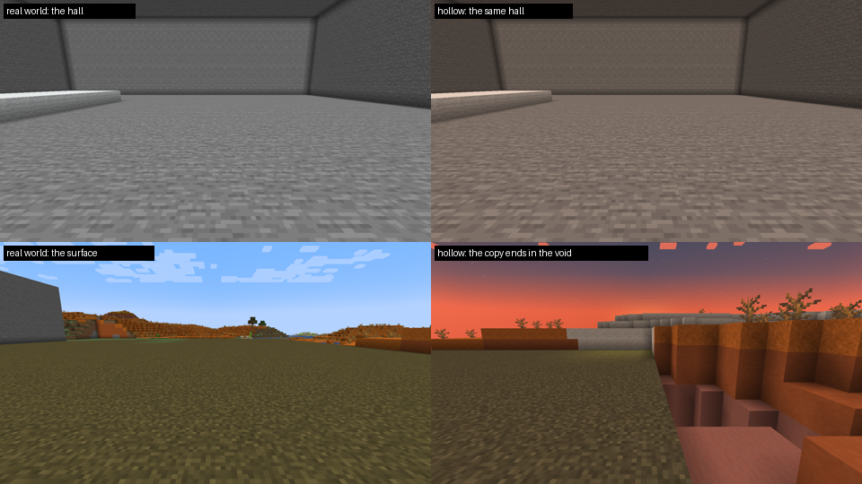

# Этап 4: Пробуждение

Решение, принятое вместе с автором (SPEC 9): противостояние идёт не в реальном мире, а в **изнанке** — копии
окружающей местности в отдельном измерении `tremor:hollow`. Реальный мир во время события не меняется. Этап разбит на
три части:

| Часть | Что | Статус |
|---|---|---|
| 4a | Изнанка: измерение, участки, копирование, перенос с затемнением, возврат после выхода из игры | готово |
| 4b | Нарастание в реальном мире: зона, тишина, дыхание, рябь от шагов, побег, поглощение | — |
| 4c | Изнанка как уровень: узел, смыкание, затягивание, исходы, провал при поражении | — |

## 4a. Изнанка

Проверено в игре сценариями [autotest/stage4a-hollow.txt](../autotest/stage4a-hollow.txt) и
[stage4a-relog-1/2](../autotest/stage4a-relog-1.txt):

| Проверка | Результат |
|---|---|
| `/tremor hollow enter` в каменном зале | экран гаснет, копия 65 × 49 × 65 блоков (229 тыс.) готова за 22 тика: 121 мс серверного времени, худший тик 12 мс; игрок в `tremor:hollow` в той же точке |
| Копия выглядит как оригинал | те же блоки, свет и биомы; изнанка застыла в сумерках и чуть темнее |
| `/tremor hollow leave` | экран гаснет, игрок в обычном мире ровно на исходном месте, участок изнанки очищается (~45 тиков) |
| `/tremor restore` | все события завершены, игроки возвращены |
| Выход из игры внутри изнанки, затем вход | игрок сразу в обычном мире в исходной точке, событие закрыто, участок очищен |

**Как устроено.**

* **Измерение `tremor:hollow`.** Пустой плоский мир (без слоёв, биом `the_void`), высота как у обычного мира. Время
  застыло в сумерках. Кровати и якоря не работают, мобы не появляются.
* **Участки.** Каждое событие получает свой участок, далеко от остальных (спираль вокруг центра границы мира, шаг 64
  чанка). Смещение — целые чанки по горизонтали, высота та же, поэтому координаты копии и оригинала совпадают с
  точностью до сдвига. Пока идёт событие, чанки участка держатся загруженными.
* **Копирование.** Работа идёт кусками 16×4×16 в пределах 5 мс за тик. Блоки пишутся прямо в секции чанков: при этом
  песок не падает, вода не течёт, механизмы не срабатывают. Высоты, свет, точки интереса и биомы обновляются как после
  `/fill`. Из реального мира читаются только загруженные чанки, незагруженное становится камнем. Вокруг копии —
  оболочка: в пещерах камень, над поверхностью воздух. Порталы в копии становятся воздухом.
* **Перенос.** Экран темнеет, пока идёт копирование. Игрок переносится в ту же точку участка после того, как копия и
  свет готовы, а экран светлеет, когда клиент получил чанки вокруг. Обратно — так же, с поиском свободного места рядом
  с исходной точкой. Клиент сам снимает затемнение на экране смерти, при возрождении и через 60 с без сигнала
  сервера.

**Правила изнанки: копии — муляжи, всё игрока возвращается ему.**

* **Копии — муляжи.** Сломанная копия ничего не даёт, в том числе от взрыва и падения. Сундуки, печи, верстаки и
  прочее не открываются и не работают. Из копий нельзя набрать воду или лаву вёдрами, обработать их инструментами или
  наловить рыбу. Порталы не работают, молний нет.
* **Блоки, которые поставил игрок, — его.** Они ломаются с обычным выпадением. Всё, что осталось к концу события
  (вместе с содержимым шалкеров и сундуков), выпадает там, куда игрок вернулся. Туда же уходят все предметы и опыт,
  оставшиеся в изнанке.
* **Существа игрока не пропадают.** Попугай с плеча и питомцы возвращаются в реальный мир, ведра с мобами и яйца
  призыва в изнанке не используются.
* **Ограничения.** Лодки, вагонетки, стойки для брони, рамки, картины, воронки, раздатчики и т.п. ставить нельзя.
  Строить можно только в пределах своего участка.
* **Вход и выход.** Попасть в изнанку можно только через событие: порталы, жемчуг и телепорт сюда отменяются. Любой
  игрок, оказавшийся в изнанке без своего события, сразу возвращается.
* **Выход из игры.** Точка возврата хранится в файле игрока. Если игрок вышел внутри изнанки или сервер упал, при
  входе он оказывается на этой точке.

**Команды:** `/tremor hollow enter | leave | status`, `/tremor restore`.
